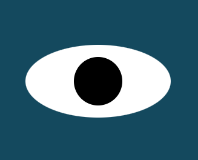

# Eye-Exercise

## Description of Project:
This project creates two eyes that follow your mouse around the screen.

## How to Run:
Start by downloading all files in the same folder on your machine. Load the index.html file in your browser. Use your mouse to move around the screen. Watch as the eyes track the mouse location.

## License Information:
This project is licensed under the MIT License.
